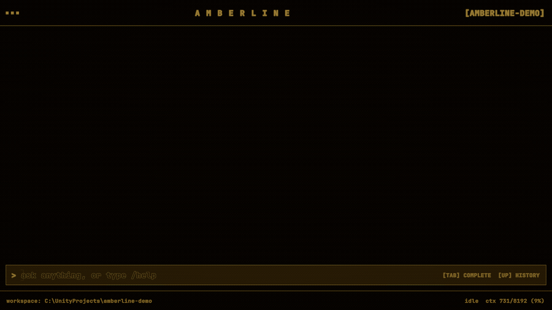
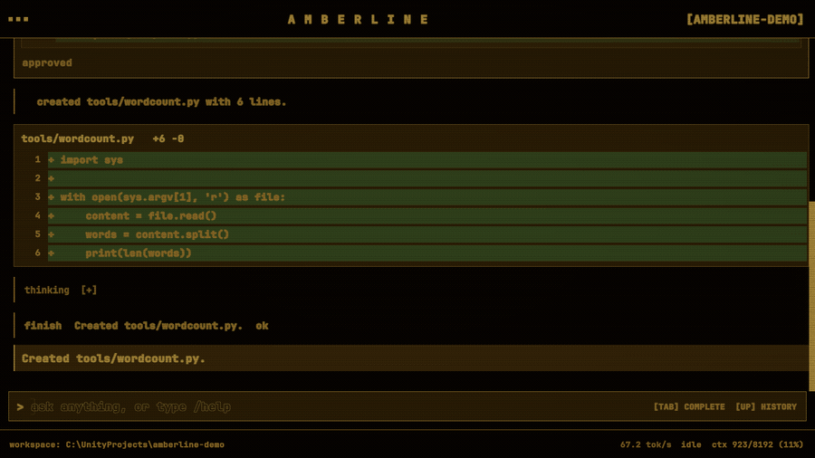
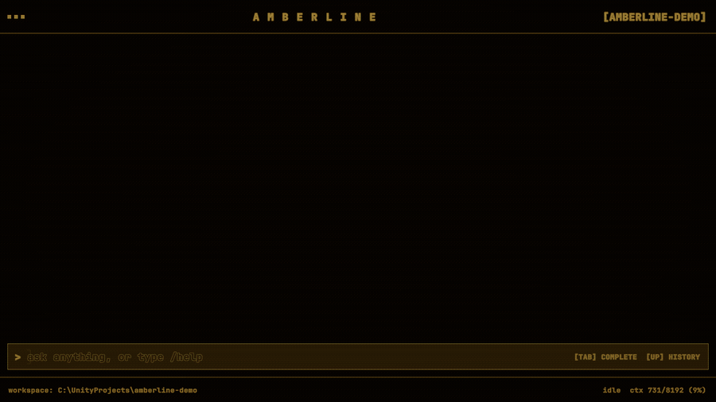
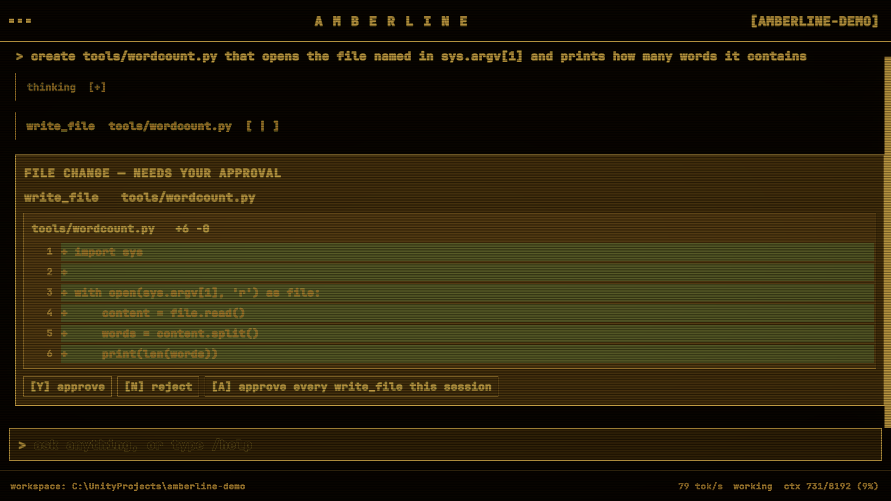
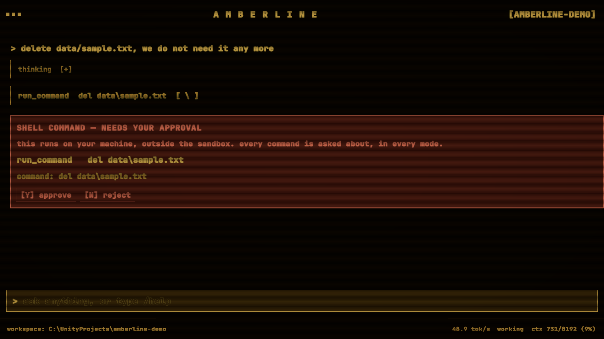
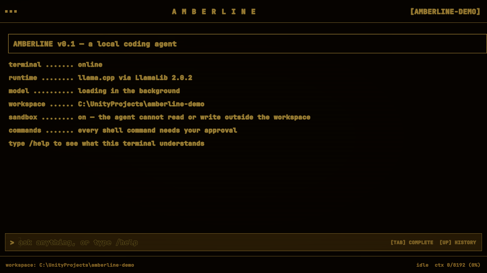

<h1 align="center">amberline</h1>

<p align="center">
  <b>A coding agent that runs entirely on your own computer</b><br>
  — at runtime inside Unity, in a terminal styled after a 1980s amber CRT.
</p>

<p align="center">
  
  
  
  
  
</p>

> *"create tools/wordcount.py that opens the file named in sys.argv[1] and prints how many words it contains"*



<p align="center">
  <sub><b>Real speed, nothing sped up.</b> You type a task in plain English; it thinks, writes the file,
  shows you exactly what it wants to put on disk — and waits for a keypress. Six seconds, start to
  finish, with the model running on the graphics card in that machine and nothing leaving it.</sub>
</p>

---

## What this is, in plain words

You give it a folder. You type what you want in ordinary English.

It reads the files, writes the code, runs the commands — and **stops to ask you before it changes
anything**. You answer with one key: `y` or `n`.

The part that makes it unusual: the AI is not in the cloud. There is no API key anywhere in this
project, no account, no subscription, and no bill. The model is a file on the disk, and it runs on
the graphics card in the machine. Unplug the network and it keeps working.

The part that makes it fun: the whole thing lives in a **game engine** — and not as an editor
plugin. It runs at runtime, in Play mode, like any other Unity app. The terminal is real Unity UI,
rendered to a texture and pushed through a CRT shader: scanlines, glow, the lot. Press Play and you
have a coding assistant.

> I built it after months of using [Claude Code](https://claude.com/claude-code), because I wanted to
> know what is actually inside one of these things — and whether Unity, which everyone thinks of as a
> tool for making games, could host a serious developer tool. It can.

It is a **small** agent. Nine tools, one folder, one conversation at a time. There is no MCP, no
skills, no subagents, no hooks and no plugin system — the parts that make a hosted assistant like
Claude Code extensible are simply not there. What is left is the loop: plan, call a tool, read the
result, ask before touching anything, repeat.

---

## See it work

Two more clips from the same session, recorded the same way — nothing sped up. A
4-billion-parameter model on one consumer graphics card, working in a small throwaway project.

### 1 · It uses the terminal, and commits its own work

> *"now add tools/wordcount.py to git and commit it with a short message"*



Nobody told it which command to run. It chose `git add … && git commit -m "Add word count tool"`,
asked permission, streamed the output live as it ran, read the result — `1 file changed, 6
insertions(+)` — and reported back. It wrote the commit message too.

### 2 · It takes "no" for an answer

> *"delete data/sample.txt, we do not need it any more"*



Refused once, the model did not stop at a variation of the same command. It tried **five different
ways**: `del`, then `move`, then `ren`, then editing the project's README to mark the file obsolete,
then rewriting that README from scratch. Each one stopped and asked. Each one was refused, and the
file is still there.

That is what the gate is for. A small model is quick and cheap, and sometimes wrong in a way a build
or a test would not catch, so nothing it does reaches the disk without a keypress. Shell commands
have no way to opt out of that, in any mode.

---

## What it can do

Nine tools. All of them available from the first turn.

| Tool | What it does |
|---|---|
| `read_file` | reads a file with line numbers, up to 200 lines at a time |
| `list_dir` | lists a folder, two levels deep |
| `grep` | finds text across files — plain text, not regex, because small models mangle escaping |
| `find_file` | finds a file by name anywhere in the workspace |
| `write_file` | creates or replaces a file — **shows a diff and waits** |
| `edit_file` | changes one exact passage in a file — **shows a diff and waits** |
| `run_command` | runs a shell command — **always waits, in every mode** |
| `ask_user` | asks you a question when the task is ambiguous, and uses your answer |
| `finish` | ends the run with a summary |

Eleven slash commands, typed straight into the terminal:

`/help` · `/cwd` · `/cd` · `/context` · `/tools` · `/approve-mode` · `/compact` · `/resume` ·
`/undo` · `/clear` · `/exit`

`/undo` puts the last file change back, byte for byte, from a journal kept outside the workspace.
`/resume` brings back the previous conversation in this folder. `Escape` cancels a run in flight.

<table>
<tr>
<td></td>
<td></td>
</tr>
</table>

---

## How it works

```
you type a task
      |
      v
 THINK  ............ the model plans out loud; the plan streams onto the screen
      |
      +--> did the plan already contain a complete tool call?  -- yes --> use it
      |
      v no
 ACT  .............. ask again, this time forcing the answer into a valid shape
      |
      v
 repair  ........... five stages of fixing broken JSON, because it will be broken
      |
      v
 sandbox  .......... every path the model names is checked against the granted folder
      |
      v
 permission gate  .. writes, edits and commands stop here and wait for a keypress
      |
      v
 run it, trim the output, remember what happened, loop
```

A run gets at most 14 trips to the model, so it always ends: either with an answer, or with a
message saying it could not do the task.

---

## Honest limits

- **No extension system.** No MCP servers, no skills, no subagents, no hooks, no plugins and no web
  access. The nine tools above are the whole surface, and adding a tenth means writing C#.
- **Windows only.** macOS and Linux are not verified and are out of scope. The shell integration and
  the filename rules are Windows-shaped.
- **One tool call per turn.** No parallel calls, no repo-wide map, no patch-format edits.

---

## Run it yourself

| | |
|---|---|
| OS | Windows 10/11 |
| Unity | **6000.4.11f1** (URP) |
| GPU | NVIDIA, 8 GB. Built and measured on an RTX 4060 8 GB |
| Disk | ~3.8 GB of native binaries, plus ~2.3 GB for the model |
| Network | For those two downloads. Nothing after that |

1. **Clone the repo and open it in Unity 6000.4.11f1.**

2. **Wait for the first import.** The LLM for Unity package downloads and unpacks LlamaLib v2.0.2 —
   3.77 GB — on first open. Those binaries are not in this repository: seven of them are over
   GitHub's 100 MB per-file limit, and the CUDA build carries NVIDIA redistributables whose terms do
   not clearly cover shipping them inside someone else's source tree. It is a one-time download, and
   it is why this repo itself clones in seconds.

3. **Download the model.** It is not fetched automatically. Select the `LLM Host` object in the
   scene and pick **Qwen 3 4B** in the `LLM` component's model dropdown; the package downloads
   `Qwen3-4B-Q4_K_M.gguf` into `%APPDATA%\LLMUnity\models`, outside the project. Any GGUF chat model
   will work — the prompt format is read from the model's own template — but this is the one measured
   end to end here.

4. **Check the settings.** The scene ships with the configuration that was measured to fit an 8 GB
   card:

   | Setting | Value | Why |
   |---|---|---|
   | Context size | 8192 | Larger silently spills into system RAM, and generation collapses |
   | Batch size | 512 | |
   | GPU layers | 50 | All of them, for this model |
   | Flash attention | off | Measured 2.2× slower on this build |
   | Parallel prompts | 1 | One conversation at a time |

   With more video memory, raise the context size first — that is what runs out, not speed.

5. **Point it at a folder.** On the `Terminal UI` object, set `Workspace Folder Path`. Left empty it
   uses the folder containing this Unity project, and `/cd <path>` moves it at any time.
   Use a throwaway project the first time: the sandbox keeps it inside the folder, but nothing
   keeps it from being wrong *inside* that folder except you.

6. **Open `Assets/Scenes/SampleScene.unity` and press Play.** This is what you get:



`Run In Background` is already enabled in the project settings and needs to stay that way. With it
off, an unfocused Unity window freezes the game loop while the model keeps generating on another
thread — and a run that takes minutes then looks like a hang.

---

## Inside the repo

54 C# files, about 15,600 lines including comments. The comments explain why things are the way
they are, including a few approaches that were tried and dropped.

```
Assets/Scripts/
  Agent/                       namespace Amberline.Agent
    Core/      the run loop, the event stream, the data types
    Llm/       LlmGateway     — the only class that touches the inference package
    Prompt/    building the exact bytes the model sees
    Parsing/   turning what comes back into a tool call, however broken it is
    Grammar/   forcing valid output when the model will not produce it
    Tools/     the registry, the runner, and nine executors
    Safety/    PathSandbox, ApprovalGate
    Files/     atomic writes, diffs, an undo journal
    Context/   keeping the conversation inside the window
    Shell/     running a command and killing its whole process tree
  Ui/                          namespace Amberline.Ui
    the terminal controller, the slash commands, the approval flow, and the views

Assets/UI Toolkit/    UXML screens, USS styles, rendered to a texture
Assets/Shaders/CRT/   the CRT shader graph, applied as a URP full-screen pass
docs/implementation-plan.md   the plan of record: decisions, milestones, the risk
                              register, and every measurement taken along the way
```

Dependencies run one way: the UI depends on the agent, never the reverse. Nothing in
`Amberline.Agent` mentions a view, and `LlmGateway` is the only class that names the inference
backend, so swapping it out touches one file.

The long version — what was tried, what was measured, and what got dropped after measuring — is in
[`docs/implementation-plan.md`](docs/implementation-plan.md).

---

## Licence

amberline is MIT — see [`LICENSE`](LICENSE).

Third-party components and their licences are in
[`THIRD-PARTY-NOTICES.md`](THIRD-PARTY-NOTICES.md). In short:
[LLM for Unity](https://github.com/undreamai/LLMUnity) and LlamaLib are Apache-2.0,
[llama.cpp](https://github.com/ggml-org/llama.cpp) is MIT, [UniTask](https://github.com/Cysharp/UniTask)
is MIT, and [JetBrains Mono](https://github.com/JetBrains/JetBrainsMono) — the only third-party asset
actually redistributed here — is under the SIL Open Font License 1.1.

No model weights are distributed with amberline. Each model carries its own licence.

## Thanks

[LLM for Unity](https://github.com/undreamai/LLMUnity) by UndreamAI, which turns local inference in
Unity into a package reference instead of a project. [llama.cpp](https://github.com/ggml-org/llama.cpp),
underneath all of it. [JetBrains Mono](https://github.com/JetBrains/JetBrainsMono), which is what the
terminal is made of. And [Claude Code](https://claude.com/claude-code), for the idea.
