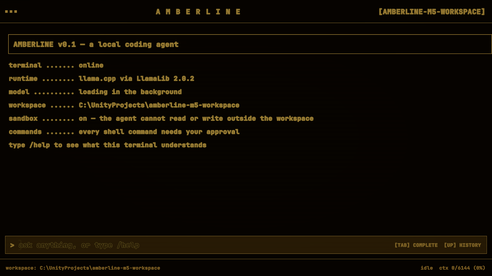
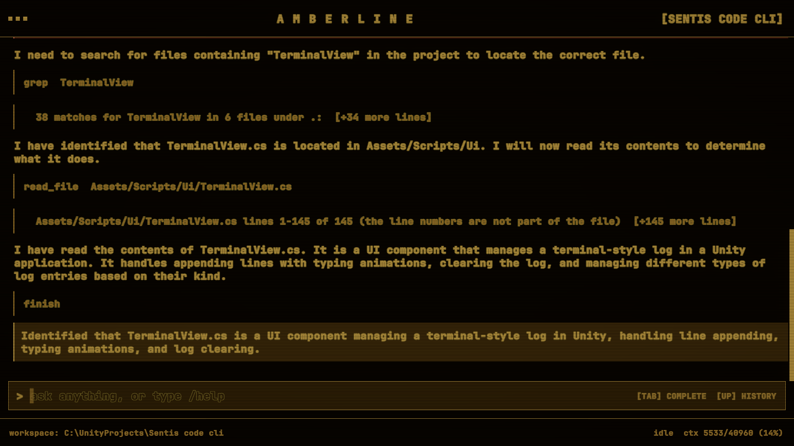
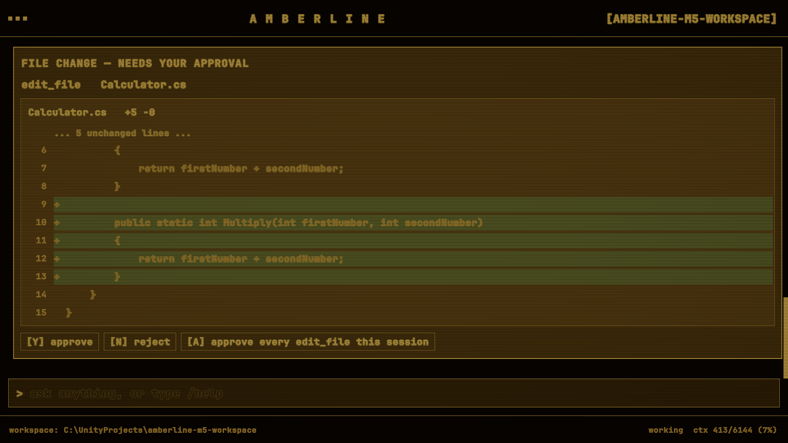

# amberline

A local coding agent that lives in an amber CRT terminal, running in Unity Play mode. You grant it a folder; it reads, searches and edits files there and runs shell commands, each one behind an approval gate. Inference is llama.cpp on your own GPU — no cloud, no API key, nothing leaves the machine.


---

<!--
================================================================================
DEMO VIDEO — REPLACE THIS BLOCK.  Read all of it before recording.
================================================================================

WHAT TO RECORD (15-25 seconds, 1920x1080 — the Game View is fixed to that size):
  boot sequence -> a typed task -> the plan streaming -> a tool card ->
  a diff card in green and red -> pressing Y -> the build going green.
The M5 run in docs/implementation-plan.md is a ready-made script for this.

HOW TO GET A URL WITHOUT COMMITTING THE FILE — do not put the video in the repo.
The .gitignore work exists so this repo clones in seconds; a 20 MB GIF undoes it.
  1. Open any issue in this repository (or a draft release) in the browser.
  2. Drag the .gif or .mp4 into the comment box and wait for the upload to finish.
  3. GitHub replaces it with a permanent URL on its own CDN, of the form
     https://github.com/user-attachments/assets/<uuid>
     (older uploads use user-images.githubusercontent.com — both work).
  4. Copy that URL. Close the issue without posting; the asset URL stays live.

HOW TO EMBED IT — what actually renders in GitHub-flavoured Markdown:
  * GIF   -> normal image syntax. Renders inline and animates everywhere,
             including the mobile app:
                 
  * MP4   -> paste the bare uploaded URL on a line of its own, with no Markdown
             or HTML around it. GitHub turns an uploaded video URL into an
             inline player:
                 https://github.com/user-attachments/assets/<uuid>
             Wrapping it in  or [](), or in a <video> tag, breaks it.
  * YouTube/Vimeo -> NOT embeddable. README HTML is sanitized, so <iframe> and
             <video> are stripped. Use a clickable thumbnail instead, and commit
             only the thumbnail PNG (tens of KB):
                 [](https://youtu.be/VIDEO_ID)

SIZE: GitHub's attachment limit at the time of writing is 10 MB for images and
GIFs, 100 MB for video. If an upload is refused, shorten the clip or re-encode
rather than committing the file.

RECOMMENDED: both. A short GIF that proves it works in three seconds, then a
linked long-form video underneath for anyone who wants more.
================================================================================
-->

> **[ demo video goes here — see the comment above for exactly how to embed it ]**
>
> A 20-second capture: boot, a task typed in, the model's plan streaming, tool cards, a diff waiting for approval, the build going green.

---

## Screenshots

| | |
|---|---|
|  |  |



---

## What it is

A ReAct coding agent — plan, call a tool, read the result, repeat — with three things that make it different from the usual wrapper around a hosted API:

- **The model runs on your machine.** Qwen3-8B, 4-bit, through llama.cpp. There is no API key anywhere in the project and no network traffic at inference time.
- **The approval gate is the product, not a safety bolt-on.** An 8B model on a consumer GPU is not trustworthy enough to write to your disk unattended, so it never does. Every write, every edit and every shell command stops the loop and draws a card you answer with a keypress.
- **Unity is only the host.** The agent knows nothing about Unity — no `AssetDatabase`, no editor APIs, no Unity-specific tools. Verification is a generic `run_command`, so `dotnet build`, `npm run build` and `pytest` are all the same thing to it. The acceptance run for shell commands deliberately drove a plain `dotnet new console` project outside the Unity project, to prove the point.

The terminal itself is UI Toolkit rendered to a texture, put through a CRT shader as a URP full-screen pass: scanlines, vignette, and bloom at 3.0 for the amber glow.

---

## How it works

```
you type a task
      |
      v
 THINK pass ......... unconstrained, 256-token budget, the plan streams to screen
      |
      +--> did the plan already contain a complete <tool_call>?  -- yes --> take it (one round trip)
      |                                                              |
      v no                                                           |
 ACT pass ........... same prompt + the thought, generated under a   |
      |               GBNF grammar built from the callable tools     |
      v                                                             |
 parse ladder <-------------------------------------------------------+
      |               extract -> repair -> coerce, five stages, each one recorded
      v
 sandbox ............ every model-supplied path resolved and contained here, or refused
      |
      v
 approval gate ...... writes, edits and commands stop and wait for a keypress
      |
      v
 execute, truncate the output, append to the transcript, loop
```

The budget is 14 round trips to the model per run, not 14 iterations, so a model that needs both passes every turn still terminates in bounded wall-clock time.

A few decisions inside that are worth spelling out.

**We drive a plain `LLMClient`, not `LLMAgent`.** Grammar and sampling only reach the native object through `LLMClient.GetCaller()`; `LLMAgent.GetCaller()` returns a different C++ instance, so a grammar set on an agent is silently ignored. Owning the transcript ourselves also sidesteps three package defects instead of working around them.

**We render the ChatML envelope by hand.** LLM for Unity 3.0.1 removed the C# chat-template layer entirely, so a raw `Completion()` is a verbatim channel to the model. The ACT prompt is a byte-exact prefix extension of the THINK prompt — that is the only reason llama.cpp's KV cache survives the second pass of a turn.

**The grammar is a fallback, not the main road.** A GBNF grammar is built from exactly the tools callable this turn, with each tool's JSON skeleton baked into literals, and it is produced together with the assistant prefill so the two cannot drift. It is proven to work: a probe grammar of `root ::= "GRAMMAR-PROBE-OK"` produced exactly that literal and nothing else. But see the honest note below — in the accepted runs it never had to fire.

**The parse ladder assumes the model's JSON is broken.** Extraction (last `<tool_call>` block, missing close tag, markdown fences, balanced braces), then a speculative repair cascade where each repair is kept only if re-parsing then succeeds, then key/type coercion. A parse that needed an unterminated string closed is flagged truncated, and a truncated *mutating* call is refused rather than executed — otherwise repair happily turns a cut-off `write_file` into valid JSON that writes half a source file.

**Seven tools, every parameter required.** `read_file`, `list_dir`, `grep`, `finish` are available from the start; `write_file`, `edit_file`, `run_command` unlock after the first successful read. The phases are additive, never substitutive — an agent that loses `grep` after its first read cannot do "find where X is used and fix it". Optional parameters were dropped because they force the grammar into an alternation over key subsets.

**Tool output is capped before it enters the transcript,** not before it hits the screen: 200 lines for a read, 30 hits for a grep, 200 entries for a listing, the last 60 lines of a command. Context is the scarce resource here, not screen space.

---

## What came out of building it

This is the part I would read first. Everything below was measured, and where a design assumption was falsified by measurement it was cut rather than kept.

### A 40960-token context made every run 14x slower, and nothing reported an error

Runs got dramatically slower as the transcript grew: about 15 s at 431 tokens, 90 s at 3.3 k, **8 minutes** at 5.4 k. The streaming buffer sat empty through the long waits, so it was prompt processing, not decoding.

The prompt cache was ruled out first, because it was the cheapest thing to rule out — same prompt twice, then the same prompt plus a suffix:

| Probe | Prompt | Time to first token |
|---|---|---|
| cold | 2177 tokens | 177 511 ms |
| same prompt again | 2177 tokens | **276 ms** |
| same prompt + suffix | 2187 tokens | **347 ms** |

A 643x gap. The cache worked perfectly. Raw prefill on a cold prefix was simply slow.

It was VRAM overcommit. Weights 4792 MiB, plus a KV cache of 144 KiB per token over 40960 tokens, plus a non-flash attention buffer — about 13 GiB of request against an 8 GiB card. Windows' WDDM sysmem-fallback policy makes that allocation **succeed** instead of failing: the overflow is backed by system RAM and reached over PCIe. Read off the performance counters, the Unity process held 5269 MiB of dedicated VRAM and **8589 MiB of shared system memory**. Every prefill batch was streaming the model across the bus.

Sizing the context to the hardware — 6144 tokens, batch 256 — fixed it:

| Prompt | Before | After | |
|---|---|---|---|
| 552 tokens | 15 799 ms (34.9 tok/s) | **866 ms (637 tok/s)** | 18x |
| 2178 tokens | 177 338 ms (12.3 tok/s) | **5 149 ms (423 tok/s)** | 34x |
| 5427 tokens | 905 001 ms (6.0 tok/s) | **24 891 ms (218 tok/s)** | 36x |

A full five-call run went from about **12 minutes to 50 seconds**.

The obvious fix was measured and rejected. Flash attention is the standard answer to attention memory, and on this build it is **2.2x slower**: at a context both configurations fit, a 2185-token prompt ran at 377 tok/s with flash attention off and 169 tok/s with it on. It saves only the attention compute buffer, which is far cheaper to shrink by halving the batch. It stays off. 8192 context was also tried and rejected — it loads fine and only collapses once a prompt is long enough to touch the pages that did not fit, which is exactly why the original bug looked like "slower as the transcript grows" rather than like an out-of-memory error.

### The grammar never fired, and saying so is more useful than pretending otherwise

The two-pass design constrains the ACT pass with a GBNF grammar so a malformed tool call is not something the model can produce. In the accepted runs, **all five calls of the exploration run and all nine of the verification run parsed at the first stage through the fast path**: Qwen3 ran straight from its plan into a complete, well-formed `<tool_call>` every time, so the ACT pass was never needed. The grammar is a proven fallback for degraded output. It is not what makes the tool calls valid in practice.

### The sandbox rejects with `Path.GetRelativePath`, not `StartsWith`

The predecessor agent used a `StartsWith` check on the resolved path. That comparison is not segment-aligned: with a root of `C:\Test` it accepted `..\TestDirectory\x.txt` — which resolves outside — for reads **and** for writes, and with a root of `C:\proj` it accepted every file under a sibling `C:\proj2`. `GetRelativePath` answers the question actually being asked: what is the route from the root to this path, and does it begin by walking out.

On top of containment: `..` segments, rooted and absolute paths, `~`, colons (drive letters *and* NTFS alternate data streams), wildcards and control characters, paths over 400 characters, Windows reserved device names (`CON`, `NUL`, `COM1`…`LPT9`, at any depth and with any extension), `.meta` files, and a deny-list of `Library`, `Temp`, `obj`, `Logs`, `UserSettings`, `.git`, `ProjectSettings` matched against every segment. Symlinks and junctions are **refused rather than resolved**, because `FileSystemInfo.ResolveLinkTarget` is a .NET 6 API that does not exist on Unity's .NET Standard 2.1 surface — and refusing a link is the safer default anyway, since a followed link is a second invisible way out.

Every rejection produces a sentence written for the *model* to read, because the model is the one that has to pick a different path next turn.

### The best argument for the approval gate is a run that passed

In the shell-command acceptance run the agent read a real `CS0117: 'Calculator' does not contain a definition for 'Multiply'`, wrote the missing method, ran the build again and saw it go green. Nine tool calls, all correct in shape.

The method it wrote returns `firstNumber + secondNumber`. From a function called `Multiply`.

The compiler cannot catch that. The build passing is not the task being done. But the diff was on screen, in green, with the wrong operator in it, and a human could have said no. That is the whole design in one screenshot.

### Exiting Play mode mid-generation was a use-after-free waiting to happen

`LLMClient` has no `OnDestroy`, no `OnDisable` and no `Dispose`. `LLM.OnDestroy` synchronously deletes the native model and calls `FreeLibrary` — while a completion may still be running inside that module on a thread-pool thread. Nothing in the package cancels or waits first. It killed the Editor once, for real, during a slow prefill.

The shutdown drain is ours: cancel every in-flight slot, then wait for the native call to actually finish, with a 180 s safety valve and a log line once the wait passes 750 ms so a frozen Editor says why. That bound is not decoration — one measured drain took **9253 ms**, and the earlier fixed 5 s bound would have unloaded the DLL under a live call on that very exit.

### `Run In Background` is a correctness setting, not a convenience

With `runInBackground` off and the Unity window unfocused, the player loop freezes — `Time.frameCount` measured stuck at 78, and `await UniTask.DelayFrame(3)` never resumed — while native calls kept working, because they run on the thread pool. A coding agent runs for minutes and the user *will* alt-tab, so this presents as "it hangs sometimes" rather than as a clean stop. It is enabled in `ProjectSettings.asset`.

### Small things that were only found by running it

- Auto-scroll pinning had to key off an actual *decrease* in the scroll value, but a log that gets **shorter** produces one too — and this product shortens its log twice, on `/clear` and when an approval card loses its row of keys. So the very first approval unpinned the terminal for the rest of the session and every line after it landed below the fold.
- Locking the input row with `SetEnabled(false)` removes focus, and a disabled element receives no key events — so the "esc cancels a running turn" hint could never have worked. The row is locked with `isReadOnly` instead.
- Qwen3-8B ignores a rejection. Told "the user rejected the edit_file call, do not repeat it", it re-proposed the same change three times, narrating "I need to try a different approach" and then sending the same one. The gate held, but each retry cost a keypress. The gate now remembers rejections by tool name plus target — deliberately not by argument hash, which is exactly what the model slips past by nudging the anchor.

---

## What it can do

| Tool | Phase | Notes |
|---|---|---|
| `read_file(path, start_line, end_line)` | from the start | line-numbered, 200-line / 64 KB budget, binary guard, footer naming the line to continue from |
| `list_dir(path)` | from the start | hand-written walk, two levels, prunes denied folders before entering them |
| `grep(pattern, path)` | from the start | literal, case-insensitive, grouped per file. Deliberately not regex — a regex needs escaping twice, which is where small models break |
| `finish(summary)` | from the start | ends the run |
| `write_file(path, content)` | after the first read | dry run, diff, approval, journal, atomic write |
| `edit_file(path, find, replace)` | after the first read | three-stage match (exact, CRLF-normalised, indentation-tolerant), unique occurrence required, near-miss hints |
| `run_command(command)` | after the first read | **always** approval-gated, in every permission mode |

Slash commands: `/help`, `/cwd`, `/context`, `/tools`, `/approve-mode`, `/compact`, `/undo`, `/clear`, `/exit`. Escape cancels a running turn.

`run_command` runs through the platform shell in the workspace root, closes stdin so an interactive prompt hits EOF instead of hanging forever, streams stdout and stderr into the terminal line by line while the command runs, kills the whole process tree with `taskkill /T` on cancel, and has a hard 180-second timeout.

`/undo` reverts the last file change from a journal kept outside the workspace, under `Application.persistentDataPath` — verified byte-for-byte, including line endings and the absence of a BOM.

---

## Honest limits

Read this before the setup section, not after.

- **Windows only.** macOS and Linux are not verified and are explicitly out of scope. The shell integration, the process-tree kill and the reserved-device-name rules are all Windows-shaped.
- **An 8B model on a consumer GPU is what it is.** It fixes a compiler error it can see. It can also write `a + b` in a method called `Multiply`, and it will re-propose an edit you just rejected. It is a competent junior with no memory and no judgement, which is why nothing it writes reaches disk without a keypress.
- **Qwen3-family models only.** The ChatML envelope is rendered by hand for Qwen; a Llama-3.2-format model would not work through it. A smaller `Qwen3.5-4B` is a promising fit for the memory budget but its chat template is unverified, so it is not claimed to work.
- **Context is tight.** 6144 tokens is near the arithmetic maximum for this model on an 8 GiB card. An exploration-heavy run finished at 91% of the window; the verification run finished at 32%, because a whole `dotnet build` costs about 90 tokens in the transcript while a `read_file` costs hundreds. `/compact` works and was measured taking a two-run transcript from 2440 to 934 tokens; the automatic 75% trigger has never fired in a real run, so only the manual path is proven.
- **One tool call per turn.** No parallel calls, no unified-diff edit format (measurably worse for weak models than whole-file writes), no repo map.
- **Not offline on day one.** Inference is fully local, but the first Editor open downloads 3.77 GiB of native binaries and you then download a ~4.8 GiB model. Offline *after* setup.
- **Non-English toolchains are on you.** `run_command` is generic and knows nothing about .NET, so a localised compiler reports its errors in the system language. Error *codes* stay English, so the model is not blind, but the explanation is not. Set `DOTNET_CLI_UI_LANGUAGE=en` if you want the model reasoning about the message rather than translating it. Relatedly, command output is decoded as UTF-8 — right for every modern build tool, wrong for old Windows tools like `ping` that still write the console OEM code page.
- **`bin/` is not on the deny-list** (`obj/` is), so after a build the agent sees build output alongside source.
- **No automated test suite is committed.** The parse ladder was checked against a 52-case harness run outside the project — all 52 pass — and every milestone was verified by driving the real thing in Play mode and reading the bytes back off disk. There is no CI, which is why there is no CI badge.
- **The approval card is keyboard-first.** `y`, `n` and `a` are the product; the on-screen chips are the label for them. The CRT pass warps the image after pointer mapping, so a click near the edge lands a few pixels off.

---

## Requirements

| | |
|---|---|
| OS | Windows 10/11 |
| Unity | **6000.4.11f1** (URP) |
| GPU | NVIDIA, 8 GB VRAM. Developed and measured on an RTX 4060 8 GB |
| Disk | ~3.8 GiB of native binaries, plus ~4.8 GiB for the model |
| Network | For the two downloads above. Nothing after that |

CPU-only inference will technically run and will be far too slow to use as an agent.

---

## Setup

1. **Clone and open the project in Unity 6000.4.11f1.**

2. **Wait for the first import.** LLM for Unity downloads and extracts LlamaLib v2.0.2 — 3.77 GiB — into `Assets/StreamingAssets/` on first Editor open, from the [LlamaLib release](https://github.com/undreamai/LlamaLib/releases/tag/v2.0.2). Those binaries are not in this repository: seven of them exceed GitHub's 100 MB per-file limit, and the Windows CUDA build carries NVIDIA redistributables whose terms do not clearly cover standalone redistribution in a source tree. This is a one-time download, and it is why the repo itself clones in seconds.

3. **Download the model.** It is *not* fetched automatically, and the filename-to-path registry lives in PlayerPrefs rather than in the repo — so a fresh clone opens a scene that names a model it cannot find. Select the `LLM Host` object, and in the `LLM` component's model dropdown choose **Qwen 3 8B**. LLM for Unity downloads [`Qwen3-8B-Q4_K_M.gguf`](https://huggingface.co/unsloth/Qwen3-8B-GGUF/resolve/main/Qwen3-8B-Q4_K_M.gguf) into `%APPDATA%\LLMUnity\models`, outside the project.

4. **Check the model settings.** The scene ships with the configuration that was measured to fit an 8 GiB card:

   | Setting | Value | Why |
   |---|---|---|
   | Context size | 6144 | Larger silently spills into system RAM and prefill collapses |
   | Batch size | 256 | Halves the attention buffer at no measured throughput cost |
   | Flash attention | off | Measured 2.2x slower on this build |
   | GPU layers | 99 | All of them |
   | Parallel prompts | 1 | One slot; a plain `LLMClient` only has slot 0 |

   With more VRAM, raise the context first — it is the binding constraint, not speed.

5. **Point it at a folder.** On the `Terminal UI` object, set `Workspace Folder Path` on `TerminalCliController`. Left empty it falls back to the folder containing this Unity project. **Point it at a throwaway project the first time.** The sandbox will stop it leaving the folder; nothing will stop it being wrong inside the folder except you.

6. **Open the scene in `Assets/Scenes/` and press Play.**

`Run In Background` is already enabled in the project settings and must stay that way — see above for what happens otherwise.

---

## A worked example

The run that closed the shell-command milestone. Workspace: a throwaway `dotnet new console` project where `Program.cs` calls `Calculator.Multiply` and `Calculator.cs` only has `Add`.

```
> the project here does not build. run dotnet build, read the compiler error and fix it.
```

| # | Call | Result |
|---|---|---|
| 1 | `run_command dotnet build` | refused by phase — "look at the project first with list_dir, grep or read_file" |
| 2 | `list_dir .` | 5 entries |
| 3-5 | `read_file` x3 | `Calculator.cs`, `Program.cs`, `calc.csproj` |
| 6 | `run_command dotnet build` | card -> **y** -> 12 lines streamed live -> `error CS0117`, `Build FAILED.`, exit 1 |
| 7 | `edit_file Calculator.cs` | card + diff `+5 -0` -> **y** -> written |
| 8 | `run_command dotnet build` | card -> **y** -> `Build succeeded.`, 0 errors, exit 0 |
| 9 | `finish` | "Fixed the error by adding the Multiply method and confirmed the build succeeded." |

Nine round trips, every one taking the fast path, finishing at 1978 of 6144 context tokens. And the method it added does addition — see above.

That run is also why the budget is 14 round trips rather than 10: it spent nine, and only fit because no call needed the ACT pass. One constrained pass anywhere in it would have ended the run a step short of the answer, which reads to the user as the agent giving up rather than as a budget expiring.

---

## Repo layout

42 C# files, about 12 000 lines including comments. The comments carry the reasoning; several files explain what was measured and rejected as well as what shipped.

```
Assets/Scripts/
  Agent/
    Core/      AgentRunner, AgentLoop, AgentEvents, AgentDataTypes
    Llm/       LlmGateway            — the only class that references LLMUnity
    Prompt/    ChatMlPromptRenderer, PromptBuilder, SystemPromptText
    Parsing/   ToolCallParser, JsonRepairer, RepeatedCallDetector
    Grammar/   GbnfGrammarBuilder
    Tools/     ToolRegistry, ToolRunner, ToolDefinition + 7 executors
    Safety/    PathSandbox, ApprovalGate
    Files/     FileWriteService, LineDiff, FileText
    Context/   ContextManager, ToolOutputTruncator
    Shell/     CommandRunner
  Ui/          TerminalCliController and 11 views
Assets/UI Toolkit/   UXML screens, USS styles, PanelSettings -> render texture
Assets/Shaders/CRT/  the CRT shader graph and material
docs/implementation-plan.md   the plan of record: decisions, architecture,
                              milestones, risk register, and a progress log
                              with the measurements quoted above
```

The dependency runs one way: UI depends on the agent core, never the reverse. Nothing in `Amberline.Agent` references a view type, and `LlmGateway` is the only place the backend is named.

`docs/implementation-plan.md` is where every number on this page comes from.

---

## Licence

amberline is MIT — see [`LICENSE`](LICENSE).

Third-party components and their licences are listed in [`THIRD-PARTY-NOTICES.md`](THIRD-PARTY-NOTICES.md). In short: [LLM for Unity](https://github.com/undreamai/LLMUnity) and LlamaLib are Apache-2.0, [llama.cpp](https://github.com/ggml-org/llama.cpp) is MIT, [UniTask](https://github.com/Cysharp/UniTask) is MIT, and [JetBrains Mono](https://github.com/JetBrains/JetBrainsMono) — the only third-party asset actually redistributed here — is under the SIL Open Font License 1.1, with the full text in `Assets/Fonts/OFL.txt`.

No model weights are distributed with amberline. Each model carries its own licence.

## Acknowledgements

[LLM for Unity](https://github.com/undreamai/LLMUnity) by UndreamAI, which makes local inference in Unity a package reference instead of a project. [llama.cpp](https://github.com/ggml-org/llama.cpp), underneath all of it. [JetBrains Mono](https://github.com/JetBrains/JetBrainsMono), which is what the terminal is made of.
